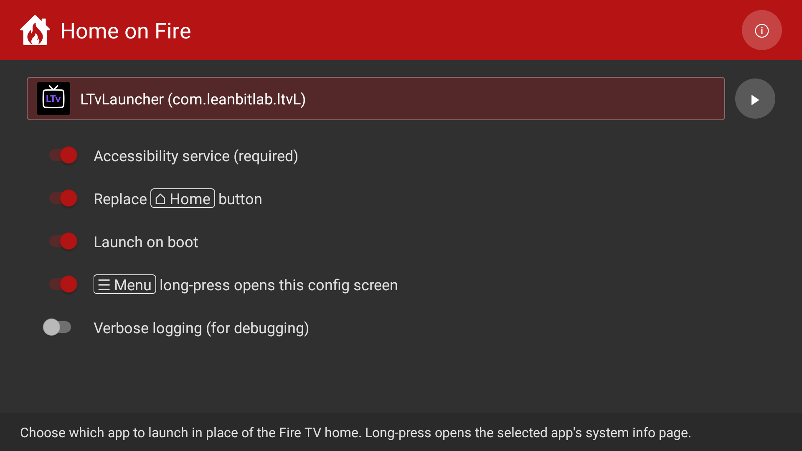

<p align="center">
  
</p>

<p align="center">
  <a href="https://github.com/toolicious/home-on-fire/releases/latest"></a>
  <a href="./LICENSE"></a>
  
</p>

# Home on Fire

**Home on Fire** is a small Android app for Fire TV that
redirects the remote's <kbd>⌂ Home</kbd> button to a launcher of
your choice. Optionally also launches that target automatically
at device boot, so the Fire TV wakes up on your launcher instead
of Amazon's home screen.

Unlike older launcher-replacement tools, **Home on Fire** works
on current Fire OS 8.x (as of May 2026) because it redirects the
<kbd>⌂ Home</kbd> button rather than trying to override the home activity itself.

<!-- App configuration screen -->



Package: `io.github.toolicious.homeonfire`

---

## Contents

- [TL;DR](#tldr)
- [Compatibility](#compatibility)
- [Why this exists](#why-this-exists)
- [Features](#features)
- [Installation](#installation)
- [Building from source](#building-from-source)
- [Known limitations](#known-limitations)
- [Privacy](#privacy)
- [License](#license)
- [Credits](#credits)

---

## TL;DR

**Install** (from your computer, with Android `platform-tools`
on PATH):

```
adb connect <fire-tv-ip>:5555
adb install home-on-fire.apk
adb shell pm grant io.github.toolicious.homeonfire android.permission.WRITE_SECURE_SETTINGS
```

**Set up on the TV:** open **Home on Fire**, flip the
**Accessibility service** switch on, then click the
**Choose target app…** chip and pick your launcher.

**Remote control buttons at a glance:**

- <kbd>⌂ Home</kbd> in a third-party app: opens your target instead of
  Amazon's home.
- <kbd>⌂ Home</kbd> double-press within 1 s: escapes to Amazon's home.
- <kbd>⌂ Home</kbd> long-press: toggles between target and Amazon's
  home (may briefly show Quick-Settings; <kbd>↩ Back</kbd> dismisses).
- <kbd>↩ Back</kbd> or <kbd>◉ OK</kbd> on the focused Home icon on Amazon's home
  screen: opens your target.
- <kbd>☰ Menu</kbd> long-press (~ 500 ms): opens our config screen.

**Privacy:** fully local. No network access, no telemetry, no
analytics, no data collection of any kind. See
[Privacy](#privacy) for details.

---

## Compatibility

**Supported: Fire OS 8.** Built and tested against Fire OS 8.1.6.9
(post-September-2025 patch) on an Amazon Ember TV. Should also
work on older Fire OS 8.x builds out of the box. The app targets
Android API 34 with a minimum of API 21.

**Not supported: Vega OS.** Since October 2025 Amazon has started
rolling out a new **Vega OS** (a Linux-based system built on
React Native, not Android) on new Fire TV devices, starting with
the *Fire TV Stick 4K Select*. All future Fire TV Sticks are
confirmed to ship on Vega OS, and **sideloading is no longer
officially supported on those devices**: only apps from the
Amazon Appstore can be installed. Existing Fire OS devices stay
supported; for any new purchase, check the OS first.

**Tested it on another device?** Please add your result to the
[compatibility reports thread](https://github.com/toolicious/home-on-fire/issues/1),
a single pinned issue so reports stay in one place instead of
scattered across separate issues. The first post has a short
copy-paste form. The Fire OS version and build number are under
**Settings → My Fire TV → About**.

---

## Why this exists

On Fire OS 8 the <kbd>⌂ Home</kbd> button always pulls you back to Amazon's
launcher. Third-party launchers install fine but can't catch the
key. The AOSP machinery (`pm set-home-activity`, the long-press
picker) is closed to sideloaded apps, and the September 2025
patch shut the last system-user exploits older workarounds relied
on.

**Home on Fire** works around it with an Accessibility Service that
watches for Amazon's home activity becoming foreground, then
launches the configured target on top. **Redirect, not
replacement**: Amazon's launcher might flash for ~250 ms, and
it stays the OS-level home activity.

---

## Features

| | |
|---|---|
| **Replace <kbd>⌂ Home</kbd> button** | Short-press in a third-party app opens your target instead of Amazon's home. Double-press within 1 s escapes to Amazon's home. Long-press toggles between target and Amazon's home. <kbd>↩ Back</kbd> or <kbd>◉ OK</kbd> on the focused Home icon returns to target. |
| **Launch on boot** | Optionally launches the target app right after device boot and on wake from standby, so the device shows your launcher instead of Amazon's home in both cases. |
| **<kbd>☰ Menu</kbd> long-press shortcut** | Hold the <kbd>☰ Menu</kbd> button for half a second from inside the target or any Amazon screen. Opens our config screen. |

---

## Installation

**Home on Fire** is sideload-only. There is currently no store release.

There are two installation paths, depending on whether your Fire
OS build still has a working **Settings → Accessibility** page:

- **Path A (no ADB needed).** If Accessibility settings open and
  let you toggle services, you can install the APK from a USB
  stick or via the **Downloader** app and enable the service
  through the system UI.
- **Path B (ADB workaround).** On most stripped Fire OS 8 builds
  the Accessibility page is blank or unresponsive. You then need
  ADB once to grant the `WRITE_SECURE_SETTINGS` permission so
  the in-app toggle can do the enabling itself. After that one
  grant you never need ADB again.

The quickest way to find out which one applies to you: open
**Settings → Accessibility** on the Fire TV. If you see a clean
list with toggles, take Path A. If the page is blank or you can't
focus anything, take Path B.

### Path A: install without ADB

1. **Download the APK** on your computer or phone:
   `home-on-fire.apk` from the GitHub release page.
2. **Move the APK to the Fire TV.** Two common ways:
    - **USB stick** (works on Fire TV Cube, some Smart TVs with
      built-in Fire TV, and Sticks with a USB-OTG adapter). Copy
      the APK onto the stick, plug it into the Fire TV, open the
      Fire-OS file browser, navigate to the APK, and select it.
    - **Downloader app** from the Amazon Appstore. Install it on
      the Fire TV, type or paste the GitHub release URL of the
      APK, let it download, then select the downloaded file to
      install. This is the usual route for Fire TV Sticks
      without a USB port.
3. The first time you sideload an APK, Fire OS asks for
   permission to install from unknown sources. Allow it.
4. **Enable the accessibility service.** Open
   **Settings → Accessibility** on the Fire TV, find
   **Home on Fire** in the services list and turn it on.
5. **Pick a target app.** Launch **Home on Fire** from the apps
   grid, click the **Choose target app…** chip and select your
   launcher.

### Path B: install via ADB

#### 1. Enable ADB on the Fire TV

On the Fire TV remote:

1. Open **Settings → My Fire TV → Developer Options**.
   (If this entry is hidden, go to **About**, scroll to the
   **Fire TV Stick / Cube** line, and click it seven times until
   it tells you developer mode is unlocked.)
2. Set **ADB debugging** to **On**.
3. Note the IP shown under **Settings → My Fire TV → About →
   Network**. Looks like `192.168.x.x`.

#### 2. Get ADB

Two options:

- **On a computer.** Download Google's `platform-tools` zip from
  <https://developer.android.com/tools/releases/platform-tools>
  (Windows / macOS / Linux). Extract it and open a terminal in
  that folder. You don't need the full Android SDK.
- **On an Android phone.** Install
  [Termux](https://github.com/termux/termux-app) from F-Droid or
  the GitHub releases page (the Play Store build is outdated),
  then run `pkg update && pkg install android-tools` to get
  `adb` into PATH.

iOS is not practical: Apple's sandbox blocks third-party `adb`
binaries, no maintained equivalent.

The commands below use plain `adb`. On a computer in the
platform-tools folder, prefix it with `./` (POSIX) or `.\`
(PowerShell). On Termux it's already on PATH.

#### 3. First connect

```
adb connect <fire-tv-ip>:5555
```

The first time, the Fire TV will pop up a "Allow USB debugging?"
prompt. Confirm it on the TV. After that, `adb devices` should
list `192.168.x.x:5555` as `device`.

#### 4. Install the APK

Download `home-on-fire.apk` from the GitHub release page (or
fetch it directly):

```
curl -L -o home-on-fire.apk \
  https://github.com/toolicious/home-on-fire/releases/latest/download/home-on-fire.apk
```

Then install:

```
adb install home-on-fire.apk
```

For updates, add `-r`:

```
adb install -r home-on-fire.apk
```

#### 5. Grant the secure-settings permission

The accessibility service is normally enabled via
**Settings → Accessibility → Home on Fire**. On Fire OS that page
is often broken (the reason you're on Path B). Granting
`WRITE_SECURE_SETTINGS` via ADB lets the in-app toggle enable the
service instead:

```
adb shell pm grant io.github.toolicious.homeonfire android.permission.WRITE_SECURE_SETTINGS
```

One-shot grant, persists across reboots.

#### 6. Launch the app

Either open **Home on Fire** from the apps grid on the TV, or
from the same terminal:

```
adb shell am start -n io.github.toolicious.homeonfire/.MainActivity
```

#### 7. Pick a target app

Inside the app, click the **Choose target app…** chip. Any
installed launcher / TV app that declares
`CATEGORY_LEANBACK_LAUNCHER` or `CATEGORY_LAUNCHER` shows up.

#### Path B in one block

Steps 3-6 condensed for re-runs or copy-paste:

```
# Download the APK (skip if you already have it on disk)
curl -L -o home-on-fire.apk \
  https://github.com/toolicious/home-on-fire/releases/latest/download/home-on-fire.apk

# Connect (Fire TV IP from Settings → My Fire TV → About → Network)
adb connect <fire-tv-ip>:5555

# Install (use -r for updates over an existing install)
adb install home-on-fire.apk

# Grant the secure-settings permission, once, so the in-app
# accessibility toggle works without the broken Settings page.
adb shell pm grant io.github.toolicious.homeonfire android.permission.WRITE_SECURE_SETTINGS

# Open the app
adb shell am start -n io.github.toolicious.homeonfire/.MainActivity
```

In the app, flip the **Accessibility service** switch and pick a
target via **Choose target app…**.

---

## Building from source

The build pipeline is deliberately tiny. No Gradle, no AppCompat,
no XML layouts. Just `aapt2` + `javac` + `d8`.

```
git clone https://github.com/toolicious/home-on-fire
cd home-on-fire
./build.ps1        # PowerShell wrapper; auto-bumps versionCode + name
```

Defaults:

- `minSdkVersion 21`, `targetSdkVersion 34`.
- The build script looks for a keystore at
  `keystore/home-on-fire.keystore`. If you forked the repo,
  generate your own with `keytool -genkey -v -keystore ...`.
  The bundled keystore is in `.gitignore` for a reason.
- The build script pushes the APK to a connected ADB device on
  success. Pass `-NoInstall` to skip that step, `-NoBump` to skip
  the version bump (e.g. for purely cosmetic rebuilds).

Manual pipeline if you'd rather not use the script:

1. `aapt2 compile --dir res -o build/res-compiled.zip`
2. `aapt2 link -o build/unsigned.apk -I <android.jar>
   --manifest AndroidManifest.xml -R build/res-compiled.zip
   --java build/gen --auto-add-overlay --min-sdk-version 21
   --target-sdk-version 34`
3. `javac -encoding UTF-8 -source 8 -target 8
   -classpath <android.jar> -d build/classes <sources>`
4. `d8 --lib <android.jar> --output build/dex <classes>`
5. Inject `classes.dex` into the APK with `jar uf`.
6. `zipalign -p 4 build/unsigned-with-dex.apk build/aligned.apk`
7. `apksigner sign --ks keystore/home-on-fire.keystore --out
   home-on-fire.apk build/aligned.apk`

---

## Known limitations

- **The 250 ms launcher flash** at every <kbd>⌂ Home</kbd> press is intrinsic
  to how the redirect works (we react to the launcher having
  already become foreground). Removing it would require the
  approaches Amazon has closed.
- **`Settings → Accessibility` may not work** on the specific Fire
  OS build you're on; the `WRITE_SECURE_SETTINGS` grant is the
  reliable way to enable the service. The app shows the exact
  ADB command as a Toast when toggling fails.

---

## Privacy

**Home on Fire** is a fully local app and does not talk to any
network. Specifically:

- **No `INTERNET` permission.** Not declared in the manifest, so
  the OS will not even let the process open a socket. No
  analytics, no crash reporting, no auto-update check, no
  phone-home.
- **No data collection.** The only state the app stores is your
  in-app settings (target package, on/off toggles), which live
  in the app's private SharedPreferences directory on the
  device and never leave it.
- **Permissions declared, and only what's needed for the
  feature:**
    - `BIND_ACCESSIBILITY_SERVICE` for the <kbd>⌂ Home</kbd> button redirect.
    - `RECEIVE_BOOT_COMPLETED` for the optional launch-at-boot.
    - `WRITE_SECURE_SETTINGS`, granted manually via ADB, so the
      in-app Accessibility toggle can work around the
      broken-on-Fire-OS Settings page (see Installation).

The source is open, so you can verify.

---

## License

[GPLv3-or-later](./LICENSE) (GNU General Public License,
version 3 or later). The same copyleft license used by FLauncher
and LtvLauncher. Fork freely; any modified version you
distribute must stay under GPL and ship its source. Each source
file carries an `SPDX-License-Identifier: GPL-3.0-or-later`
marker.

---

## Credits

- The Android team for keeping `AccessibilityService` powerful
  enough that a redirect like this is still possible without root.
- [LtvLauncher](https://github.com/LeanBitLab/LtvLauncher), a
  tidy minimalist launcher used during development.
- [Projectivy Launcher](https://github.com/spocky/miproja1) as
  an inspiration for the accessibility-redirect trick on Fire OS.
